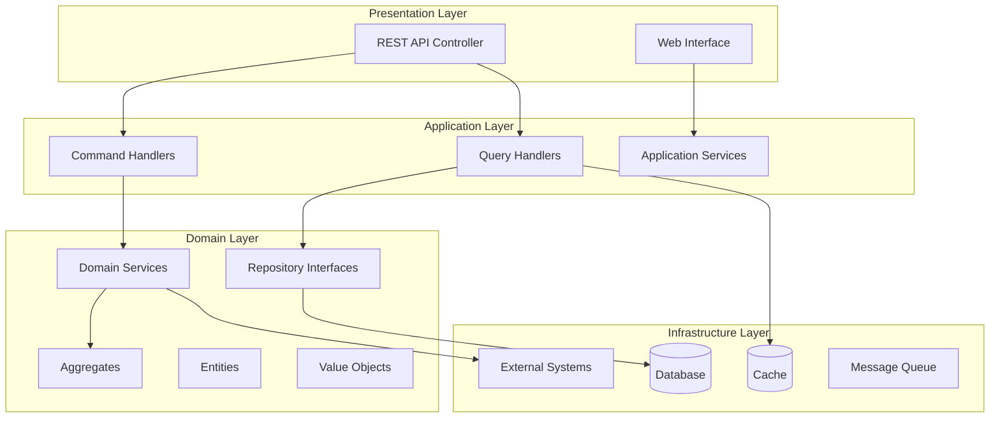
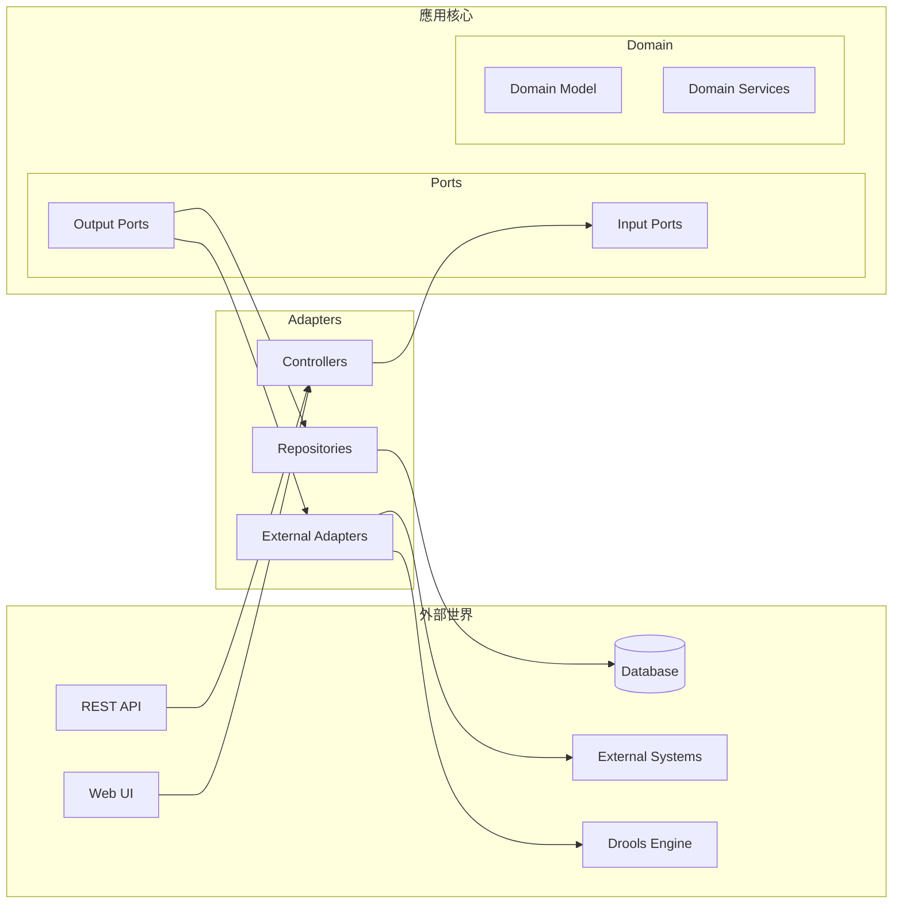

# 設計文件

## 概述

銀行客戶優惠系統採用領域驅動設計(DDD)和六角形架構，結合CQRS模式實現讀寫分離。系統核心是一個可配置的決策樹引擎，使用Command Pattern封裝節點操作，整合Drools規則引擎和SpEL表達式語言，提供靈活的優惠推薦服務。

## 架構

### 整體架構圖



### 六角形架構實現



## 組件和介面

### 領域模型設計

#### 聚合根 (Aggregate Roots)

**1. PromotionDecisionTree (優惠決策樹聚合)**
- 管理決策樹的完整生命週期
- 封裝決策邏輯和規則執行
- 確保樹結構的一致性

**2. CustomerProfile (客戶檔案聚合)**
- 管理客戶相關資訊
- 提供條件評估介面
- 維護客戶資料完整性

#### 實體 (Entities)

**DecisionNode (決策節點)**
- ConditionNode: 條件因子節點
- CalculationNode: 計算因子節點
- 支援SpEL、Drools、外部系統整合

#### 值物件 (Value Objects)

- CustomerPayload: 客戶輸入資料
- PromotionResult: 優惠推薦結果
- NodeConfiguration: 節點配置資訊
#
## CQRS 實現

#### 命令端 (Command Side)
- CreateDecisionTreeCommand: 創建決策樹
- UpdatePromotionRuleCommand: 更新優惠規則
- EvaluatePromotionCommand: 評估客戶優惠

#### 查詢端 (Query Side)
- GetPromotionHistoryQuery: 查詢優惠歷史
- GetAvailablePromotionsQuery: 查詢可用優惠
- 使用專門的讀取模型優化查詢效能

### Command Pattern 實現

```java
public interface NodeCommand {
    NodeResult execute(CustomerProfile customer, ExecutionContext context);
}

// 具體命令實現
- SpELConditionCommand: SpEL表達式條件評估
- DroolsRuleCommand: Drools規則執行
- ExternalSystemCommand: 外部系統呼叫
- DatabaseQueryCommand: 資料庫查詢
```

### 策略模式實現

```java
public interface CalculationStrategy {
    BigDecimal calculate(CustomerProfile customer, PromotionParameters params);
}

// 策略實現
- PercentageDiscountStrategy: 百分比折扣
- TieredDiscountStrategy: 階層式折扣
- FixedAmountStrategy: 固定金額優惠
```

### 狀態模式實現

```java
public abstract class PromotionState {
    // 優惠狀態管理
    - ActivePromotionState: 活躍狀態
    - SuspendedPromotionState: 暫停狀態
    - ExpiredPromotionState: 過期狀態
}
```

## 資料模型

### 資料庫環境配置

**開發階段 (Development)**
- 使用 H2 In-Memory Database 模擬資料庫行為
- 支援快速開發和測試
- 自動初始化測試資料

**SIT/UAT/生產環境**
- 使用 PostgreSQL 作為正式資料庫
- 支援 JSON 資料型別存儲複雜配置
- 提供高效能和可靠性

### 核心資料表設計

```sql
-- 決策樹配置表
CREATE TABLE decision_trees (
    id VARCHAR(36) PRIMARY KEY,
    name VARCHAR(100) NOT NULL,
    status VARCHAR(20) NOT NULL,
    root_node_id VARCHAR(36),
    created_at TIMESTAMP,
    updated_at TIMESTAMP
);

-- 決策節點表 (PostgreSQL JSON支援)
CREATE TABLE decision_nodes (
    id VARCHAR(36) PRIMARY KEY,
    tree_id VARCHAR(36) NOT NULL,
    node_type VARCHAR(20) NOT NULL,
    parent_id VARCHAR(36),
    configuration JSON NOT NULL,  -- PostgreSQL JSON type
    created_at TIMESTAMP,
    FOREIGN KEY (tree_id) REFERENCES decision_trees(id)
);

-- 優惠規則表
CREATE TABLE promotion_rules (
    id VARCHAR(36) PRIMARY KEY,
    name VARCHAR(100) NOT NULL,
    rule_type VARCHAR(20) NOT NULL,
    rule_content TEXT NOT NULL,
    parameters JSON,              -- PostgreSQL JSON type
    status VARCHAR(20) NOT NULL,
    created_at TIMESTAMP,
    updated_at TIMESTAMP
);

-- 客戶優惠歷史表
CREATE TABLE promotion_history (
    id VARCHAR(36) PRIMARY KEY,
    customer_id VARCHAR(50) NOT NULL,
    promotion_id VARCHAR(36) NOT NULL,
    promotion_result JSON NOT NULL,  -- PostgreSQL JSON type
    executed_at TIMESTAMP,
    INDEX idx_customer_date (customer_id, executed_at)
);
```

### 環境配置檔案

**application-dev.yml (開發環境)**
```yaml
spring:
  datasource:
    url: jdbc:h2:mem:testdb
    driver-class-name: org.h2.Driver
    username: sa
    password: 
  h2:
    console:
      enabled: true
  jpa:
    database-platform: org.hibernate.dialect.H2Dialect
    hibernate:
      ddl-auto: create-drop
    show-sql: true
```

**application-sit.yml / application-uat.yml / application-prod.yml**
```yaml
spring:
  datasource:
    url: jdbc:postgresql://${DB_HOST:localhost}:${DB_PORT:5432}/${DB_NAME:promotion_system}
    driver-class-name: org.postgresql.Driver
    username: ${DB_USERNAME:promotion_user}
    password: ${DB_PASSWORD:promotion_pass}
  jpa:
    database-platform: org.hibernate.dialect.PostgreSQLDialect
    hibernate:
      ddl-auto: validate
    show-sql: false
```

### 讀取模型設計

- PromotionSummaryView: 優惠摘要視圖
- CustomerPromotionHistoryView: 客戶優惠歷史視圖
- DecisionTreeConfigurationView: 決策樹配置視圖

## 錯誤處理

### 異常層次結構
- PromotionSystemException: 系統基礎異常
- DecisionTreeExecutionException: 決策樹執行異常
- ExternalSystemException: 外部系統異常
- RuleEvaluationException: 規則評估異常

### 錯誤處理策略
- 節點執行失敗時返回預設結果
- 外部系統不可用時使用降級策略
- 記錄詳細錯誤日誌供後續分析

## 測試策略

### BDD 測試場景

```gherkin
Feature: 銀行客戶優惠推薦

  Scenario: 高價值客戶獲得VIP優惠
    Given 客戶年收入為 2000000 元
    And 客戶帳戶類型為 "VIP"
    When 系統評估客戶優惠資格
    Then 應該返回 "VIP專屬理財優惠"

  Scenario: 一般客戶獲得基礎優惠
    Given 客戶年收入為 500000 元
    And 客戶帳戶類型為 "一般"
    When 系統評估客戶優惠資格
    Then 應該返回 "新戶開戶優惠"
```

### 測試層次
- 單元測試: JUnit 5 + Mockito
- 整合測試: Spring Boot Test
- 端到端測試: Cucumber BDD

## 效能考量

### 快取策略
- 決策樹配置快取
- 優惠規則快取
- 客戶檔案快取

### 非同步處理
- 優惠歷史記錄非同步寫入
- 事件驅動的通知機制

## 安全性設計

### API 安全
- JWT Token 驗證
- 角色基礎存取控制
- 資料權限檢查

### 資料保護
- 敏感資料遮罩
- 審計日誌記錄
- 資料加密存儲