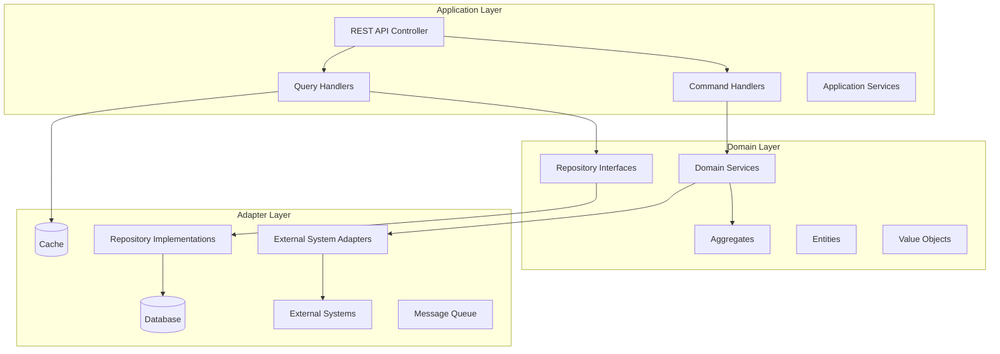
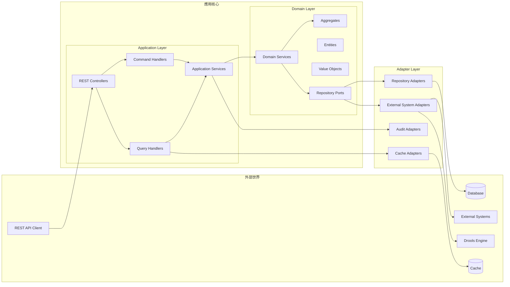

# 設計文件

## 概述

銀行客戶優惠系統採用領域驅動設計(DDD)和六角形架構，結合CQRS模式實現讀寫分離。系統核心是一個可配置的決策樹引擎，使用Command Pattern封裝節點操作，整合Drools規則引擎和SpEL表達式語言，提供靈活的優惠推薦服務。

## 架構

### 整體架構圖



### 六角形架構實現



## 組件和介面

### 領域模型設計

#### 聚合根 (Aggregate Roots)

**1. PromotionDecisionTree (優惠決策樹聚合)**
- 管理決策樹的完整生命週期
- 封裝決策邏輯和規則執行
- 確保樹結構的一致性

**2. CustomerProfile (客戶檔案聚合)**
- 管理客戶相關資訊
- 提供條件評估介面
- 維護客戶資料完整性

**3. AuditTrail (稽核軌跡聚合)**
- 管理完整的請求處理軌跡
- 記錄每個決策步驟和系統事件
- 確保稽核資料的完整性和不可篡改性

#### 實體 (Entities)

**DecisionNode (決策節點)**
- ConditionNode: 條件因子節點
- CalculationNode: 計算因子節點
- 支援SpEL、Drools、外部系統整合

#### 值物件 (Value Objects)

- CustomerPayload: 客戶輸入資料
- PromotionResult: 優惠推薦結果
- NodeConfiguration: 節點配置資訊
#
## CQRS 實現

#### 命令端 (Command Side)
- CreateDecisionTreeCommand: 創建決策樹
- UpdatePromotionRuleCommand: 更新優惠規則
- EvaluatePromotionCommand: 評估客戶優惠

#### 查詢端 (Query Side)
- GetPromotionHistoryQuery: 查詢優惠歷史
- GetAvailablePromotionsQuery: 查詢可用優惠
- GetAuditTrailQuery: 查詢稽核軌跡
- GetDecisionStepsQuery: 查詢決策步驟
- 使用專門的讀取模型優化查詢效能

### Command Pattern 實現

```java
public interface NodeCommand {
    NodeResult execute(CustomerProfile customer, ExecutionContext context);
}

// 具體命令實現
- SpELConditionCommand: SpEL表達式條件評估
- DroolsRuleCommand: Drools規則執行
- ExternalSystemCommand: 外部系統呼叫
- DatabaseQueryCommand: 資料庫查詢
```

### 策略模式實現

```java
public interface CalculationStrategy {
    BigDecimal calculate(CustomerProfile customer, PromotionParameters params);
}

// 策略實現
- PercentageDiscountStrategy: 百分比折扣
- TieredDiscountStrategy: 階層式折扣
- FixedAmountStrategy: 固定金額優惠
```

### 狀態模式實現

```java
public abstract class PromotionState {
    // 優惠狀態管理
    - ActivePromotionState: 活躍狀態
    - SuspendedPromotionState: 暫停狀態
    - ExpiredPromotionState: 過期狀態
}
```

## 資料模型

### 資料庫環境配置

**開發階段 (Development)**
- 使用 H2 In-Memory Database 模擬資料庫行為
- 支援快速開發和測試
- 自動初始化測試資料

**SIT/UAT/生產環境**
- 使用 PostgreSQL 作為正式資料庫
- 支援 JSON 資料型別存儲複雜配置
- 提供高效能和可靠性

### 核心資料表設計

```sql
-- 決策樹配置表
CREATE TABLE decision_trees (
    id VARCHAR(36) PRIMARY KEY,
    name VARCHAR(100) NOT NULL,
    status VARCHAR(20) NOT NULL,
    root_node_id VARCHAR(36),
    created_at TIMESTAMP,
    updated_at TIMESTAMP
);

-- 決策節點表 (PostgreSQL JSON支援)
CREATE TABLE decision_nodes (
    id VARCHAR(36) PRIMARY KEY,
    tree_id VARCHAR(36) NOT NULL,
    node_type VARCHAR(20) NOT NULL,
    parent_id VARCHAR(36),
    configuration JSON NOT NULL,  -- PostgreSQL JSON type
    created_at TIMESTAMP,
    FOREIGN KEY (tree_id) REFERENCES decision_trees(id)
);

-- 優惠規則表
CREATE TABLE promotion_rules (
    id VARCHAR(36) PRIMARY KEY,
    name VARCHAR(100) NOT NULL,
    rule_type VARCHAR(20) NOT NULL,
    rule_content TEXT NOT NULL,
    parameters JSON,              -- PostgreSQL JSON type
    status VARCHAR(20) NOT NULL,
    created_at TIMESTAMP,
    updated_at TIMESTAMP
);

-- 客戶優惠歷史表
CREATE TABLE promotion_history (
    id VARCHAR(36) PRIMARY KEY,
    customer_id VARCHAR(50) NOT NULL,
    promotion_id VARCHAR(36) NOT NULL,
    promotion_result JSON NOT NULL,  -- PostgreSQL JSON type
    executed_at TIMESTAMP,
    INDEX idx_customer_date (customer_id, executed_at)
);

-- 稽核軌跡表
CREATE TABLE audit_trails (
    id VARCHAR(36) PRIMARY KEY,
    request_id VARCHAR(36) NOT NULL,
    customer_id VARCHAR(50) NOT NULL,
    operation_type VARCHAR(50) NOT NULL,
    operation_details JSON NOT NULL,
    execution_time_ms INTEGER,
    status VARCHAR(20) NOT NULL,
    error_message TEXT,
    created_at TIMESTAMP NOT NULL,
    INDEX idx_request_id (request_id),
    INDEX idx_customer_operation (customer_id, operation_type),
    INDEX idx_created_at (created_at)
);

-- 請求日誌表
CREATE TABLE request_logs (
    id VARCHAR(36) PRIMARY KEY,
    request_id VARCHAR(36) UNIQUE NOT NULL,
    api_endpoint VARCHAR(200) NOT NULL,
    http_method VARCHAR(10) NOT NULL,
    request_payload JSON NOT NULL,
    response_payload JSON,
    response_status INTEGER,
    client_ip VARCHAR(45),
    user_agent TEXT,
    processing_time_ms INTEGER,
    created_at TIMESTAMP NOT NULL,
    completed_at TIMESTAMP,
    INDEX idx_request_id (request_id),
    INDEX idx_endpoint_date (api_endpoint, created_at)
);

-- 決策步驟表
CREATE TABLE decision_steps (
    id VARCHAR(36) PRIMARY KEY,
    request_id VARCHAR(36) NOT NULL,
    tree_id VARCHAR(36) NOT NULL,
    node_id VARCHAR(36) NOT NULL,
    step_order INTEGER NOT NULL,
    node_type VARCHAR(20) NOT NULL,
    input_data JSON NOT NULL,
    output_data JSON,
    execution_time_ms INTEGER,
    status VARCHAR(20) NOT NULL,
    error_details TEXT,
    created_at TIMESTAMP NOT NULL,
    INDEX idx_request_step (request_id, step_order),
    INDEX idx_tree_node (tree_id, node_id),
    FOREIGN KEY (request_id) REFERENCES request_logs(request_id),
    FOREIGN KEY (tree_id) REFERENCES decision_trees(id)
);

-- 系統事件表
CREATE TABLE system_events (
    id VARCHAR(36) PRIMARY KEY,
    event_type VARCHAR(50) NOT NULL,
    event_category VARCHAR(30) NOT NULL,
    event_details JSON NOT NULL,
    severity_level VARCHAR(20) NOT NULL,
    source_component VARCHAR(100) NOT NULL,
    correlation_id VARCHAR(36),
    created_at TIMESTAMP NOT NULL,
    INDEX idx_event_type_date (event_type, created_at),
    INDEX idx_correlation_id (correlation_id),
    INDEX idx_severity_date (severity_level, created_at)
);
```

### 環境配置檔案

**application-dev.yml (開發環境)**
```yaml
spring:
  datasource:
    url: jdbc:h2:mem:testdb
    driver-class-name: org.h2.Driver
    username: sa
    password: 
  h2:
    console:
      enabled: true
  jpa:
    database-platform: org.hibernate.dialect.H2Dialect
    hibernate:
      ddl-auto: create-drop
    show-sql: true
```

**application-sit.yml / application-uat.yml / application-prod.yml**
```yaml
spring:
  datasource:
    url: jdbc:postgresql://${DB_HOST:localhost}:${DB_PORT:5432}/${DB_NAME:promotion_system}
    driver-class-name: org.postgresql.Driver
    username: ${DB_USERNAME:promotion_user}
    password: ${DB_PASSWORD:promotion_pass}
  jpa:
    database-platform: org.hibernate.dialect.PostgreSQLDialect
    hibernate:
      ddl-auto: validate
    show-sql: false
```

### 讀取模型設計

- PromotionSummaryView: 優惠摘要視圖
- CustomerPromotionHistoryView: 客戶優惠歷史視圖
- DecisionTreeConfigurationView: 決策樹配置視圖
- AuditTrailSummaryView: 稽核軌跡摘要視圖
- RequestProcessingView: 請求處理詳情視圖
- DecisionPathView: 決策路徑追蹤視圖
- ComplianceReportView: 合規性報告視圖

## 錯誤處理

### 異常層次結構
- PromotionSystemException: 系統基礎異常
- DecisionTreeExecutionException: 決策樹執行異常
- ExternalSystemException: 外部系統異常
- RuleEvaluationException: 規則評估異常

### 錯誤處理策略
- 節點執行失敗時返回預設結果
- 外部系統不可用時使用降級策略
- 記錄詳細錯誤日誌供後續分析

## 測試策略

### 測試驅動開發方法

**測試先行開發流程**
1. 每個主要功能模組完成後，必須先撰寫對應的 BDD 測試場景
2. 使用 Mock 物件模擬所有外部依賴，確保單元測試的獨立性
3. 透過 Dependency Injection 確保所有外部系統都可被模擬測試
4. 測試所有錯誤處理和降級策略的執行路徑

### Command Pattern 測試設計

**Mock 適配器設計**
```java
// Mock 外部系統適配器
@Component
@Profile("test")
public class MockExternalSystemAdapter implements ExternalSystemAdapter {
    private Map<String, ExternalSystemResponse> mockResponses = new HashMap<>();
    
    public void configureMockResponse(String endpoint, ExternalSystemResponse response) {
        mockResponses.put(endpoint, response);
    }
    
    @Override
    public ExternalSystemResponse call(ExternalSystemRequest request, long timeout, TimeUnit timeUnit) {
        return mockResponses.getOrDefault(request.getEndpoint(), 
                ExternalSystemResponse.failure("Mock not configured"));
    }
}

// Mock 資料庫適配器
@Component
@Profile("test")
public class MockDatabaseAdapter implements DatabaseAdapter {
    private Map<String, Object> mockData = new HashMap<>();
    
    public void configureMockData(String query, Object result) {
        mockData.put(query, result);
    }
}
```

**單元測試結構**
```java
@ExtendWith(MockitoExtension.class)
class SpELConditionCommandTest {
    
    @Mock
    private ExecutionContext mockContext;
    
    @Mock
    private CustomerPayload mockCustomer;
    
    @Test
    void shouldReturnTrueWhenConditionMet() {
        // Given
        NodeConfiguration config = createTestConfiguration("#{creditScore > 700}");
        SpELConditionCommand command = new SpELConditionCommand(config);
        
        when(mockContext.getCustomerPayload()).thenReturn(mockCustomer);
        when(mockCustomer.getCreditScore()).thenReturn(750);
        
        // When
        NodeResult result = command.execute(mockContext);
        
        // Then
        assertThat(result.isSuccess()).isTrue();
        assertThat(result.getResult()).isEqualTo(true);
    }
    
    @Test
    void shouldHandleExpressionError() {
        // Given - 測試錯誤處理
        NodeConfiguration config = createTestConfiguration("#{invalidExpression}");
        SpELConditionCommand command = new SpELConditionCommand(config);
        
        // When
        NodeResult result = command.execute(mockContext);
        
        // Then
        assertThat(result.isSuccess()).isFalse();
        assertThat(result.getErrorMessage()).contains("SpEL condition evaluation failed");
    }
}
```

### BDD 測試場景

**Command Pattern 測試場景**
```gherkin
Feature: Command Pattern 執行測試

  Scenario: SpEL 條件命令成功執行
    Given 系統配置了 SpEL 條件命令 "#{creditScore > 700}"
    And 客戶信用評分為 750
    When 執行 SpEL 條件命令
    Then 命令應該成功執行
    And 返回結果應該為 true

  Scenario: Drools 規則命令執行
    Given 系統配置了 Drools 規則 "高價值客戶判斷規則"
    And 客戶年收入為 2000000 元
    When 執行 Drools 規則命令
    Then 命令應該成功執行
    And 返回結果應該包含 "VIP客戶" 標籤

  Scenario: 外部系統命令降級處理
    Given 系統配置了外部系統命令呼叫信用評估服務
    And 外部信用評估服務不可用
    And 系統啟用降級策略
    When 執行外部系統命令
    Then 命令應該執行降級邏輯
    And 返回預設的信用評分結果
    And 系統應該記錄降級事件

  Scenario: 資料庫查詢命令錯誤處理
    Given 系統配置了資料庫查詢命令
    And 資料庫連線逾時
    When 執行資料庫查詢命令
    Then 命令應該捕獲逾時異常
    And 返回錯誤結果
    And 錯誤訊息應該包含 "Database query execution failed"

Feature: 銀行客戶優惠推薦

  Scenario: 高價值客戶獲得VIP優惠
    Given 客戶年收入為 2000000 元
    And 客戶帳戶類型為 "VIP"
    When 系統評估客戶優惠資格
    Then 應該返回 "VIP專屬理財優惠"
    And 系統應該記錄完整的決策軌跡
    And 稽核記錄應該包含所有決策步驟

  Scenario: 一般客戶獲得基礎優惠
    Given 客戶年收入為 500000 元
    And 客戶帳戶類型為 "一般"
    When 系統評估客戶優惠資格
    Then 應該返回 "新戶開戶優惠"
    And 系統應該記錄請求和回應資料

Feature: 稽核軌跡追蹤

  Scenario: 查詢客戶優惠評估軌跡
    Given 系統已處理客戶 "CUST001" 的優惠評估請求
    When 稽核人員查詢該客戶的處理軌跡
    Then 應該返回完整的決策路徑
    And 應該包含每個節點的執行時間
    And 應該包含所有外部系統呼叫記錄

  Scenario: 合規性報告生成
    Given 系統在過去30天內處理了多筆優惠評估請求
    When 合規人員生成合規性報告
    Then 報告應該包含所有請求的處理統計
    And 報告應該標示任何異常或錯誤情況
```

### 測試層次和工具

**單元測試**
- JUnit 5 + Mockito 進行單元測試
- 使用 @MockBean 模擬 Spring 組件
- 測試覆蓋率目標：90% 以上

**整合測試**
- Spring Boot Test 進行整合測試
- 使用 @TestConfiguration 配置測試環境
- 使用 H2 記憶體資料庫進行資料層測試

**端到端測試**
- Cucumber BDD 進行端到端測試
- 使用 @SpringBootTest 啟動完整應用上下文
- 模擬真實的 HTTP 請求和回應

**測試資料管理**
```java
@Component
public class TestDataManager {
    
    public CustomerPayload createHighValueCustomer() {
        return new CustomerPayload(
            "CUST001", "VIP", 
            BigDecimal.valueOf(2000000), 750, 
            BigDecimal.valueOf(500000), 
            createMockTransactionHistory()
        );
    }
    
    public NodeConfiguration createSpELConditionConfig(String expression) {
        return new NodeConfiguration(
            "test-node", "CONDITION", expression, 
            "SPEL", Map.of(), "Test SpEL condition"
        );
    }
    
    public void setupMockExternalSystem(String endpoint, Object response) {
        // 配置 Mock 外部系統回應
    }
}
```

### 錯誤處理測試

**異常情境測試**
- 測試所有可能的異常路徑
- 驗證錯誤訊息的準確性
- 確保系統在異常情況下的穩定性

**降級策略測試**
- 模擬外部系統不可用情境
- 驗證降級邏輯的正確執行
- 測試降級後的功能完整性

## 版本控制和開發流程

### Git 提交規範

**提交訊息格式**
- 使用中文提交訊息
- 格式：`完成[功能模組名稱]實作及測試`
- 範例：
  - `完成 Command Pattern 和節點命令實作及測試`
  - `完成策略模式和狀態模式實作及測試`
  - `完成 CQRS 模式和應用層實作及測試`

**提交前檢查清單**
1. 所有相關單元測試通過
2. 所有相關 BDD 測試通過
3. 程式碼覆蓋率達到 90% 以上
4. 程式碼品質檢查通過
5. 功能實作完整且符合需求

### 開發工作流程

**每個任務完成流程**
1. **實作階段**：完成功能模組的核心實作
2. **測試階段**：撰寫單元測試和 BDD 測試
3. **驗證階段**：執行所有測試確保通過
4. **提交階段**：使用規範格式進行 Git commit
5. **文件階段**：更新相關技術文件

**測試驅動開發循環**
```
需求分析 → BDD 場景撰寫 → 功能實作 → 單元測試 → 整合測試 → Git 提交
    ↑                                                                    ↓
    ←←←←←←←←←←←←←← 回歸測試和品質檢查 ←←←←←←←←←←←←←←←←←←←←←←←←←
```

### 測試策略整合

**分層測試架構**
- **單元測試層**：測試個別類別和方法
- **整合測試層**：測試組件間的互動
- **BDD 測試層**：測試業務場景和使用者故事
- **端到端測試層**：測試完整的業務流程

**持續整合要求**
- 每次 commit 觸發自動化測試
- 測試失敗時阻止合併
- 自動產生測試覆蓋率報告
- 自動檢查程式碼品質指標

## 效能考量

### 快取策略
- 決策樹配置快取
- 優惠規則快取
- 客戶檔案快取

### 非同步處理
- 優惠歷史記錄非同步寫入
- 事件驅動的通知機制

## 安全性設計

### API 文檔和開發者體驗

#### Swagger/OpenAPI 整合設計

**Swagger 配置架構**
```yaml
# Swagger 配置
springdoc:
  api-docs:
    path: /api-docs
    enabled: true
  swagger-ui:
    path: /swagger-ui.html
    enabled: true
    operationsSorter: method
    tagsSorter: alpha
  packages-to-scan: com.bank.promotion.adapter.web.controller
  paths-to-match: /api/**
```

**API 文檔結構設計**
- **API 分組**: 按功能模組分組 (優惠評估、管理、查詢、稽核)
- **資料模型**: 完整的請求/回應 DTO 定義
- **錯誤處理**: 標準化錯誤回應格式
- **安全性**: JWT 認證配置說明
- **範例資料**: 每個端點的範例請求和回應

**OpenAPI 註解策略**
```java
@RestController
@RequestMapping("/api/v1/promotions")
@Tag(name = "優惠評估", description = "客戶優惠推薦相關 API")
public class PromotionController {
    
    @Operation(summary = "評估客戶優惠", description = "根據客戶資料評估適合的優惠方案")
    @ApiResponses(value = {
        @ApiResponse(responseCode = "200", description = "評估成功"),
        @ApiResponse(responseCode = "400", description = "請求資料格式錯誤"),
        @ApiResponse(responseCode = "500", description = "系統內部錯誤")
    })
    @PostMapping("/evaluate")
    public ResponseEntity<PromotionResult> evaluatePromotion(
        @Valid @RequestBody EvaluatePromotionRequest request
    ) { ... }
}
```

### API 安全
- JWT Token 驗證
- 角色基礎存取控制
- 資料權限檢查

### 資料保護
- 敏感資料遮罩
- 審計日誌記錄
- 資料加密存儲

### 稽核安全
- 稽核資料不可篡改性保證
- 稽核資料存取權限控制
- 稽核資料備份和歸檔
- 稽核查詢操作本身也需要稽核記錄